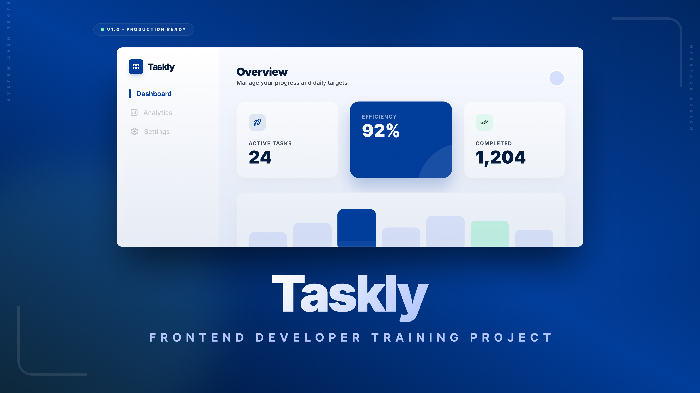

<div align="center">
  
</div>

---

<h1 align="center">Taskly — Tasks Management</h1>

<p align="center">
  A modern and responsive task management web application inspired by tools like Jira, ClickUp, and Linear.
  Built with Angular and Tailwind CSS as part of a structured frontend mentorship program.
</p>

<p align="center">
  
  
  
  
</p>

<p align="center">
  
  
  
</p>

---

##  Project Resources

| Resource | Link |
|---|---|
|  **Figma Design** | [View Design](https://www.figma.com/design/zAwYa5nDWE2YirHYPpNabw/Tasks-Management?node-id=0-1&t=L7Jf026Stu5qCTd2-1) |
| **Backend Repo** | [Backend Documentation](https://github.com/mahmoud-taha-dev/tasks-management-training) |
| **API Documentation** | [View API Docs](https://github.com/mahmoud-taha-dev/tasks-management-training/blob/main/tasks_api_docs.md) |
| **APIDog Documentation** | [View APIDog Docs](https://mr89tdrc7j.apidog.io/) |

>  A **Postman Collection** is also available directly in this repository to easily test and explore the available APIs.

---

## About The Project

Taskly is a task management web application built to simulate a real-world frontend project environment.
The project follows a structured mentorship program where features are delivered incrementally through weekly tasks.

Developers are provided with a complete set of resources including a Figma design file,
a task board on Notion, and full API documentation, just like on actual projects.

---

## Features

| Feature | Description |
|---|---|
| **Task Management** | Create, update, and organize tasks across projects |
| **Responsive Design** | Works across mobile, tablet, and desktop |
| **Design System** | Centralized Tailwind tokens for colors, typography, and spacing |
| **Scalable Architecture** | Feature-based folder structure ready for growth |
| **Type Safety** | Full TypeScript support across the project |

---

## Technologies & Tools

<p align="center">
  
  
  
  
  
  
  
</p>

| Technology | Role |
|---|---|
| **Angular** | Frontend framework |
| **TypeScript** | Type-safe JavaScript |
| **Tailwind CSS** | Utility-first styling with centralized design tokens |
| **pnpm** | Fast and efficient package manager |
| **ESLint** | Code linting with TypeScript support |
| **Prettier** | Consistent code formatting |
| **prettier-plugin-tailwindcss** | Automatic Tailwind class sorting |
| **tailwind-merge** | Resolving conflicting Tailwind classes |

---

## Getting Started

```bash
# Clone the repository
git clone <repository-url>

# Install dependencies
pnpm install

# Run in development mode
pnpm dev

# Build for production
pnpm build

# Lint the project
pnpm lint

# Format the project
pnpm format
```

---

## Project Structure

```text
taskly/
│
├── src/
│   ├── app/
│   │   ├── core/
│   │   ├── features/
│   │   ├── shared/
│   │   └── app.ts
│   │
│   ├── assets/
│   └── environments/
│
├── .env.example
├── .eslintrc.json
├── .prettierrc
├── tailwind.config.js
├── tsconfig.json
└── README.md
```

---

## Environment Variables

Copy `.env.example` and fill in your values:

```bash
cp .env.example .env
```

```env
API_URL=
```

>  Never commit actual secrets or `.env` files to the repository.

---

## Responsive Design

| Device | Support |
|---|---|
| Mobile |  Fully Responsive |
| Tablet |  Fully Responsive |
| Laptop |  Fully Responsive |
| Desktop |  Fully Responsive |
